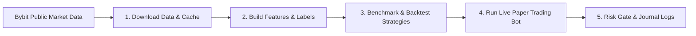

# Getting Started with Crypto Bot + ML

A beginner-friendly, step-by-step guide to setting up, understanding, and running the algorithmic trading harness and machine learning pipeline.

---

## 1. What is this Project?

This repository is a modular, event-driven trading harness and machine learning pipeline for crypto derivatives (such as `BTCUSDT`, `ETHUSDT`, `SOLUSDT`, `DOGEUSDT`) on Bybit.

### System Workflow



### Key Operating Modes
The bot supports four modes configured in [`config/settings.yaml`](file:///d:/Desktop/Coding/crypto%20bot%20+%20ML/config/settings.yaml):
- **`backtest`**: Historical simulation with fees, slippage, and funding rates (No API keys needed).
- **`paper`** *(Default)*: Live forward-trading using real-time market data and local simulated trade execution (No API keys needed).
- **`testnet`**: Integration testing on Bybit Testnet (Requires testnet API keys).
- **`live`**: Real capital execution (Strictly gated behind confirmation flags and verification).

> [!NOTE]
> For beginners, everything runs in **`paper` mode** by default. You do **NOT** need an exchange account or API keys to download data, run backtests, or run the live paper bot!

---

## 2. Step 0: Installation & Setup

### 2.1 Prerequisites
- **Python**: Version `3.11` or `3.12`
- **uv** (Recommended package manager): Fast, reliable dependency resolution

To verify your environment, open your terminal (PowerShell, Command Prompt, or Bash) in the project root directory:

```bash
# Check Python and UV versions
uv --version
python --version
```

*(If you do not have `uv` installed, you can install it via `pip install uv` or follow instructions on [astral.sh/uv](https://github.com/astral-sh/uv)).*

### 2.2 Install Dependencies
Install all project dependencies into the virtual environment:

```bash
uv sync
```

### 2.3 Create Environment File
Copy the example environment template into `.env`:

**On Windows (PowerShell):**
```powershell
Copy-Item .env.example .env
```

**On Linux / macOS:**
```bash
cp .env.example .env
```

---

## 3. Step 1: Download Historical Market Data

Before running features or backtests, download historical price candles (OHLCV) directly from Bybit's public API.

### Download 1 Year of Hourly (60m) BTC Data
```bash
uv run python scripts/download_data.py --symbol BTCUSDT --interval 60 --days 365
```

### Download a Multi-Asset Basket with Funding Rates
```bash
uv run python scripts/download_data.py --symbols BTCUSDT,ETHUSDT,SOLUSDT,DOGEUSDT --interval 60 --days 365 --funding
```

- **Saved location**: Data is stored as compressed Parquet files under [`data/raw/`](file:///d:/Desktop/Coding/crypto%20bot%20+%20ML/data/raw) (e.g., `BTCUSDT_60_mainnet.parquet`).

---

## 4. Step 2: Build Technical Features & Datasets

Transform raw OHLCV price candles into technical indicators (RSI, ATR, EMAs, return momentum, volatility z-scores) and split them into chronological subsets (train, validation, test, holdout):

```bash
uv run python scripts/build_features.py --symbol BTCUSDT --interval 60
```

- **Saved location**: Processed datasets and feature manifests are saved under [`data/datasets/`](file:///d:/Desktop/Coding/crypto%20bot%20+%20ML/data/datasets).

---

## 5. Step 3: Run Strategy Benchmarks & Backtests

Before running a live trading loop, benchmark and backtest your strategies to evaluate profitability and risk metrics.

### 5.1 Benchmark Rule-Based Strategies
Test standard rule-based strategies (Donchian breakouts, EMA crossovers, Momentum) through the execution engine:

```bash
uv run python scripts/benchmark_rulesets.py
```

### 5.2 Evaluate Multi-Asset Basket Edge
Scan cross-sectional momentum and funding squeeze strategies across multiple coins:

```bash
uv run python scripts/evaluate_basket_edge.py
```

### 5.3 Run Full Horizon & Edge Scan
```bash
uv run python scripts/evaluate_phase7_edge.py
```

---

## 6. Step 4: Run the Live Paper Trading Bot

Once historical data is cached, start the forward-running simulated trading engine.

### Option A: Test a Single Loop Tick (Smoke Test)
Run a single iteration to confirm data ingestion, risk checks, and strategy computation succeed without leaving a background process running:

```bash
uv run python scripts/run_bot.py --strategy cross_sectional --once
```

### Option B: Run Continuous Live Paper Trading (Cross-Sectional Strategy)
Start the live paper trading loop across a basket of assets:

```bash
uv run python scripts/run_bot.py --strategy cross_sectional --symbols BTCUSDT,ETHUSDT,SOLUSDT,DOGEUSDT
```

> [!TIP]
> To stop the bot at any time, press `Ctrl + C` in your terminal.

---

## 7. Step 5: Monitoring Trades, Logs & State

While the bot is running, all events, signals, and simulated orders are tracked in real time:

| Output | File Path | Description |
| :--- | :--- | :--- |
| **Application Logs** | [`logs/bot.log`](file:///d:/Desktop/Coding/crypto%20bot%20+%20ML/logs/bot.log) | Real-time logger output with timestamps, ticks, and state changes. |
| **Trade Journals** | `data/runner/journal_YYYYMMDD.jsonl` | Daily line-delimited JSON logs recording every signal, order, fill, and fee. |
| **Runner State** | `data/runner/state.json` | Persistent snapshot of current portfolio equity, open positions, and PnL. |

---

## 8. Step 6: Safety Controls & The Kill Switch

The system includes built-in risk controls defined in [`config/settings.yaml`](file:///d:/Desktop/Coding/crypto%20bot%20+%20ML/config/settings.yaml):
- **Daily Loss Limit**: Automatically halts trading if drawdown exceeds configured threshold (default 2%).
- **ATR-Based Stop Losses & Take Profits**: Attached to every order entry.
- **API Error Circuit Breaker**: Trips if consecutive connection errors occur.

### Resetting a Tripped Kill Switch
If the Kill Switch trips, a tombstone file is placed in `data/runner/` and all subsequent runs will refuse to start until inspected:

```bash
uv run python scripts/reset_kill_switch.py --reason "Inspected state and verified ledger" --yes
```

---

## 9. Step 7: Supervised Production Deployment (Docker & Systemd)

For unattended 24/7 execution, use Docker Compose or systemd with automated process supervision.

### Option A: Docker Compose Deployment
```bash
# Build and run the bot container in background
docker compose up -d

# View real-time container logs
docker compose logs -f

# Stop the bot
docker compose down
```

### Option B: Linux Systemd Service
1. Copy [`deploy/crypto-bot.service`](file:///d:/Desktop/Coding/crypto%20bot%20+%20ML/deploy/crypto-bot.service) to `/etc/systemd/system/crypto-bot.service`.
2. Enable and start the service:
```bash
sudo systemctl daemon-reload
sudo systemctl enable --now crypto-bot
sudo journalctl -u crypto-bot -f
```

---

## 10. Quick Reference Cheat Sheet

```bash
# 1. Install dependencies
uv sync

# 2. Download 1 year of market data
uv run python scripts/download_data.py --symbols BTCUSDT,ETHUSDT,SOLUSDT,DOGEUSDT --interval 60 --days 365 --funding

# 3. Build features & splits
uv run python scripts/build_features.py --symbol BTCUSDT --interval 60

# 4. Benchmark rule-based strategies
uv run python scripts/benchmark_rulesets.py

# 5. Evaluate multi-asset basket strategy
uv run python scripts/evaluate_basket_edge.py

# 6. Test 1 tick of the paper trading bot
uv run python scripts/run_bot.py --strategy cross_sectional --once

# 7. Run continuous live paper trading
uv run python scripts/run_bot.py --strategy cross_sectional --symbols BTCUSDT,ETHUSDT,SOLUSDT,DOGEUSDT

# 8. Run unit test suite
uv run pytest

# 9. Reset kill switch if tripped
uv run python scripts/reset_kill_switch.py --reason "Inspected state" --yes
```
