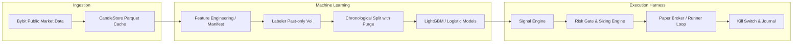

# crypto bot + ML


A modular, event-driven algorithmic trading harness for crypto derivatives (BTCUSDT) built in Python with risk controls, machine learning pipelines, and verified data hygiene.

> [!TIP]
> **New to the repo?** Check out the step-by-step [**Beginner's Getting Started Guide**](GETTING_STARTED.md).

---

## 1. System Architecture



### Core Components
- **Data Ingestion (`src/data_ingestion/`)**: Throttled, retrying Bybit V5 public kline client with candle integrity validation (gap, jump, and monotonic timestamp checks).
- **Features & Labels (`src/features/`, `src/labels/`)**: Scale-free indicator pipeline (RSI, ATR, EMAs, return momentum, volatility z-scores) with strict forward-leakage prevention and boundary purging.
- **Model Store (`src/models/`)**: Model registry with explicit `active` promotion pointer (`artifacts/models.json`) and metadata validation.
- **Risk & Limits (`src/risk/`)**: Daily loss circuit breakers, position-level ATR stops/targets, symmetric reconciliation, and atomic kill-switch tombstones.
- **Backtesting & Runner (`src/backtesting/`, `src/runner/`)**: Event-driven backtester sharing exact execution semantics with the live paper-trading loop.

---

## 2. Operating Modes & Working Rules

The bot configuration is managed via [`config/settings.yaml`](config/settings.yaml):

| Mode | Purpose | Keys Required? |
| :--- | :--- | :---: |
| `backtest` | Fast, vectorized & event-driven historical simulation with fees, slippage, and funding. | ❌ No |
| `paper` | Live forward-trading on real-time candles in a simulated ledger with identical execution semantics. | ❌ No |
| `testnet` | Connectivity smoke-tests and exchange API integration tests. | ✅ Testnet Keys |
| `live` | Real capital execution (**strictly gated** on scientific edge & testnet burn-in). | ✅ Live Keys |

> [!NOTE]
> Per project working rules, the bot operates in **paper mode**. Live execution remains gated behind empirical edge verification.

---

## 3. Operator Runbook

### 3.1 Kill-Switch Trip & Reset Runbook
If the bot encounters daily loss limit breaches, API error streaks, or reconciliation mismatches, the **Kill Switch** will trip:
1. Writes an atomic tombstone to `data/runner/tombstone.json`.
2. Cancels active orders and halts further entry attempts.
3. All subsequent runs will immediately refuse to start while the tombstone exists.

**To inspect and reset the kill switch:**
```bash
# Check status / reset kill switch
uv run python scripts/reset_kill_switch.py --reason "Inspected state; verified ledger consistency"
```

### 3.2 Model Promotion & Rollback
Model promotions are recorded in `artifacts/models.json`:
- The deployed model is explicitly declared via the `"active"` key.
- If `"active": null`, `run_bot.py` exits cleanly with code `2` ("no promotable model").
- To roll back a model, set `"active"` to a previously verified `model_id` or `null`.

### 3.3 Running Benchmarks & Tests
```bash
# Run full static analysis & type checks
uv run ruff check .
uv run ruff format --check .
uv run mypy src

# Run test suite
uv run pytest

# Run ruleset benchmark
uv run python scripts/benchmark_rulesets.py

# Run Phase 7.5 gross edge scan
uv run python scripts/evaluate_phase7_edge.py
```

---

## 4. Empirical Science Status & Alpha Research

### Phase 7 Single-Symbol Baseline Audit
A systematic scan of 42 configurations across rulesets (Donchian, EMA crossovers, Momentum) and single-symbol ML models (Logistic regression, LightGBM) on `BTCUSDT` clean mainnet data (`test` split):
- **Gross Edge Distinguishability**: 0 / 42 configurations showed a statistically significant gross edge ($p > 0.05$).
- **Cost Impact**: Realistic execution costs (~15–18 bps round-trip) eliminate gross gains on trend rulesets.
- Full report: [`artifacts/phase7_5_gross_edge_report.md`](artifacts/phase7_5_gross_edge_report.md).

### Alpha Research V2 Multi-Asset Edge Evaluation
A subsequent 46-configuration sweep across **Triple-Barrier ML Models**, **Cross-Sectional Relative Momentum**, and **Funding Rate Arbitrage / Squeeze**:
- **Funding Squeeze (`DOGEUSDT` $z \le -2.0$)**: **+70.8 bps gross** (95% CI: `[+20.3, +121.3]` bps, $p < 0.05$), **+59.7 bps net** (PF **14.96**, 75% Win Rate) — *statistically significant gross & net edge*.
- **Cross-Sectional Momentum (`SOLUSDT` Top 10%)**: **+27.6 bps gross**, **+16.6 bps net** (PF **1.10**, +0.41% net return) — *positive net trend momentum*.
- **Asymmetric Triple-Barrier (`ETHUSDT` 3.0x TP / 1.5x SL)**: **+12.5 bps gross**, **+2.3 bps net** (PF **1.03**) — *positive net expectation*.
- Full report: [`artifacts/alpha_research_v2_report.md`](artifacts/alpha_research_v2_report.md).

